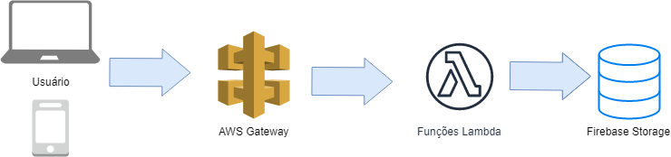

# Representação da Arquitetura

## Modelo de Arquitetura

Neste projeto foi adotada a arquitetura Serverless se utilizando do Amazon Lambda - Nela não há a necessidade de provisionamento de recursos para a execução das funções, visto que Amazon é responsável pela alocação de recursos de acordo com a utilização.

Em um exemplo de solicitação para listar todas as tarefas:
1. O Usuário seleciona a função de listar todas as tarefas através da UI
1. Esta função chama um método definido no API Gateway que está ligado a uma função Lambda
1. A função Lambda é executada e recupera os dados necessários do database, retornando um JSON.
1. Este JSON é devolvido para o usuário em um formato legível.

## Visão Lógica

### Diagrama de Classes

### Banco de Dados

###  

