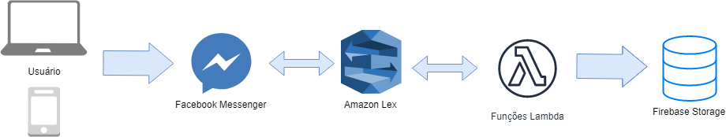
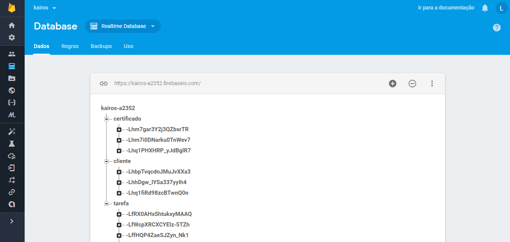

# Representação da Arquitetura

## Modelo de Arquitetura

Neste projeto foi adotada a arquitetura Serverless se utilizando do Amazon Lambda - Nela não há a necessidade de provisionamento de recursos para a execução das funções, visto que Amazon é responsável pela alocação de recursos de acordo com a utilização.

Arquitetura do sistema

Arquitetura do chatbot

## Visão Lógica
Em um exemplo de solicitação para listar todas as tarefas:
1. O Usuário seleciona a função de listar todas as tarefas através da UI;
1. Esta função chama um método definido no API Gateway que está ligado a uma função Lambda;
1. A função Lambda é executada e recupera os dados necessários do database, retornando um JSON;
1. Este JSON é devolvido para o usuário em um formato legível.

## Visão Lógica (chatbot)
Um usuário deseja saber alguma informação do sistema, como por exemplo, quantas tarefas estão pendentes para o dia:
1. O usuário pergunta no Facebook Messenger "quantas tarefas tenho hoje?"
1. O AWS Lex processa o texto e executa a função Lambda equivalente
1. A função Lambda faz a requisição dos dados apropriados no Firebase e retora os resultados para o AWS Lex
1. O Messenger retorna a resposta apropriada.

### Banco de Dados
Visto que a aplicação utiliza Firebase como o banco de dados, que é um banco NoSQL, a estrutura difere do que é normalmente utilizado. Todos os dados são estruturados em uma árvore JSON:

###  

